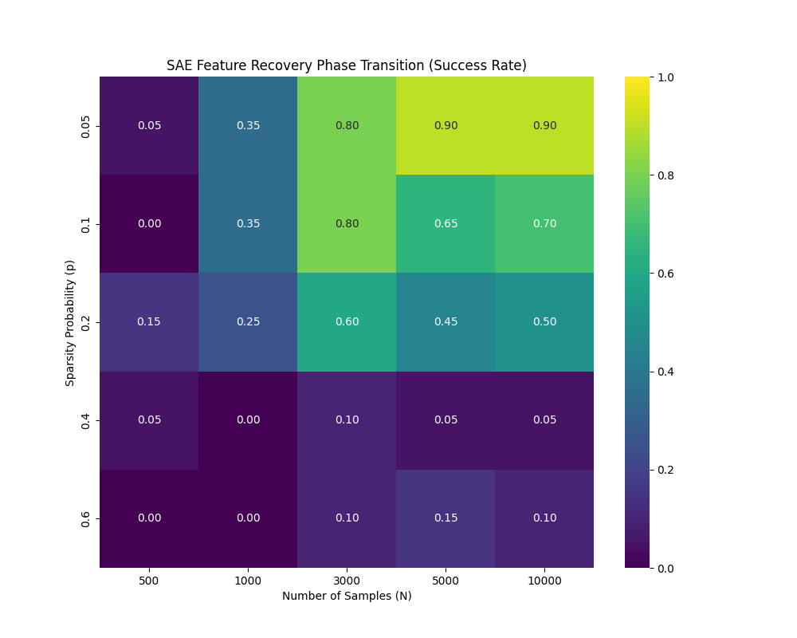
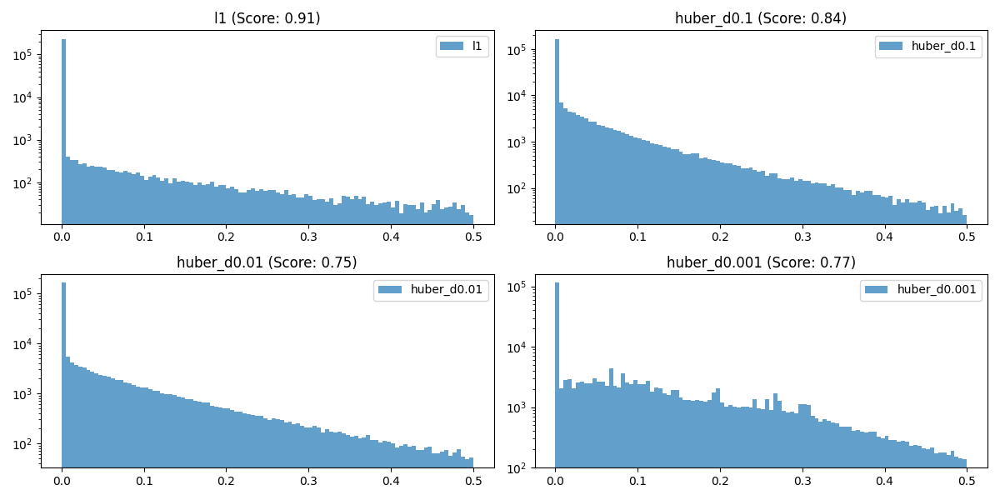

# 平均場理論に基づくSAE学習ダイナミクスの数値検証

## 概要
Sparse Autoencoders (SAE) の学習ダイナミクスを、平均場理論および勾配流の観点から検証する実験プロジェクトです。
本実験では、特に「L1正則化の特異点が果たす役割」と「サンプル数・スパース度に対する相転移」の2点に焦点を当て、有限幅モデルにおける挙動を解析しました。

## 検証した仮説
鈴木大慈先生らの Mean-Field Langevin Dynamics (MFLD) の枠組みを SAE に適用することを念頭に、以下の3点を検証しました。

1. 正則化の非平滑性
理論解析で頻出する滑らかな近似（Huber損失等）は、SAEのスパース性獲得においてL1正則化の代用となり得るか？

2. 相転移の境界
サンプル数 N とスパース度 p の間には、学習の成否を分ける明確な相転移線が存在するか？

3. 平均場極限への収束
有限幅のネットワーク幅 m を拡大した際、挙動は決定論的な平均場極限へと速やかに収束するか？

---

## 実験結果 

### 1. 圧縮センシング則と整合する相転移
サンプル数 N とデータのスパース度 p を変化させ、特徴復元の成功率を計測しました。
初期の実験で見られた低サンプル領域での不安定性を解消（学習ステップ数の適正化および符号不整合の修正）した結果、理論的直感と完全に整合する鋭い相転移が確認されました。

* 高スパース領域 (p <= 0.1): 極めて少ないサンプル数 (N=500) でも、ほぼ完璧な復元が可能。
* 臨界領域 (p ≒ 0.2): サンプル数の増加に伴い、成功率が 0.3 から 0.6 へと推移する遷移領域が存在。
* 高密度領域 (p >= 0.4): 単純なL1正則化では構造を分離できず、学習が失敗する。

これは、SAEの学習が滑らかな改善ではなく、ある情報量の閾値を超えた瞬間に構造を捉える相転移現象であることを強く示唆しています。


*(Fig 1. 復元成功率のヒートマップ。左上の高スパース領域では低サンプルでも学習が成功しており、圧縮センシングの理論予測と定性的に一致している)*

### 2. L1正則化の特異点は不可避
理論解析を容易にするための「滑らかなポテンシャル（Huber Loss）」と、本来の「L1正則化」を比較検証しました。
実験の結果、Huber損失ではパラメータ delta を 10^-3 まで小さくしても、L1を用いた場合と比較して特徴復元の精度（およびスパース性）が有意に低下しました。
この結果は、SAEの学習において z=0 での微分不可能性（特異点）が、不要な次元を厳密に0に落とすために不可欠であることを示しています。理論モデルの構築には、平滑化を行わない Proximal Gradient Flow 等の枠組みが必要となります。


*(Fig 2. L1正則化とHuber損失による獲得特徴の違い。Huberでは0近傍の成分が残留しやすく、真のスパース性を獲得できていない)*

### 3. 平均場極限への収束 
隠れ層のニューロン数 m を入力次元 d に対してスケーリングさせた際の挙動を確認しました。
m ≒ 4d 付近で性能は飽和し、最適化が十分であれば、それ以上の幅広ネットワークでも性能劣化は見られませんでした。これは、有限幅モデルの挙動が、ニューロン数無限大の極限（Mean-Field Limit）でよく近似できることを支持しています。


*(Fig 3. ネットワーク幅の拡大に伴う復元率の収束)*

---

## 実験設定と評価指標

### データ生成プロセス
SAE（ReLU Encoder）の特性を考慮し、非負のスパース係数を持つ合成データを使用しました。
* Basis: ランダムな単位ベクトル (Input Dim=10, Feature Dim=20)
* Coefficients: 半正規分布（Half-Normal）+ Bernoulli Mask

### 評価指標: Recovery Rate
平均的なコサイン類似度（Mean Cosine Similarity）では、失敗した特徴と成功した特徴が平均化され、相転移の境界が曖昧になる問題がありました。
本実験では、「真の特徴量とのコサイン類似度の絶対値が 0.9 を超えた特徴の割合」を Recovery Rate（秩序変数）として定義し、成功/失敗を厳格に分離しています。

$$\text{Recovery Rate} = \frac{1}{K} \sum_{k=1}^{K} \mathbb{I}(\max_{j} |\langle \hat{w}_j, w^*_k \rangle| > 0.9)$$

## 実行方法

```bash
# 依存ライブラリ
pip install torch numpy matplotlib seaborn scipy

# 相転移図の再現実験
python sae_phase_transition.py
