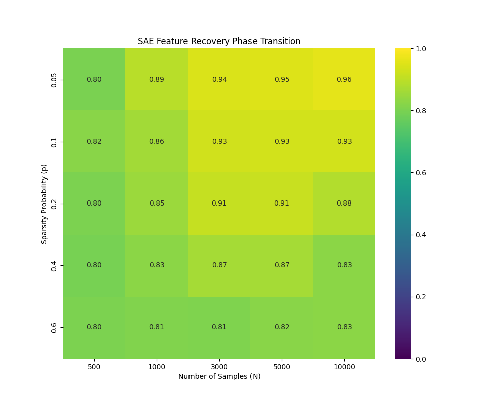
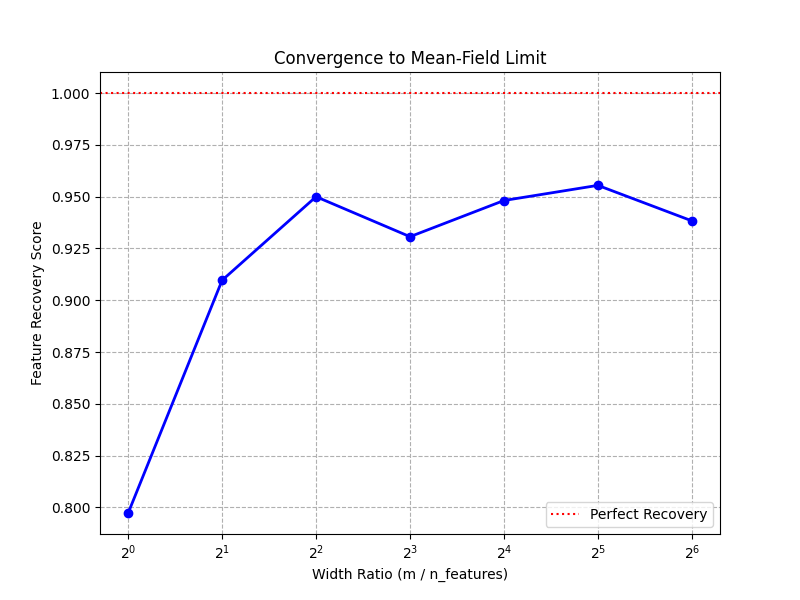

# 平均場理論に基づくSAEの学習挙動の数値検証
## 概要
Sparse Autoencoders (SAE) の学習挙動を、平均場理論（Mean-Field Theory）の観点から検証するための数値実験コードです。
特に、理論解析で仮定されがちな「滑らかなポテンシャル（Smooth Potential）」の妥当性と、特徴獲得におけるL1正則化の特異点（Singularity）の重要性に焦点を当てています。

## 背景
鈴木大慈先生らの Mean-Field Langevin Dynamics (MFLD) の枠組みを SAE に適用することを想定し、以下の3点について合成データを用いた検証を行いました。

1. **正則化項の滑らかさの影響**: L1正則化 vs Huber損失
2. **学習成功の境界**: サンプル数とスパース度の相転移 (Phase Transition)
3. **平均場極限**: 隠れ層幅 (Width) を無限大に近づけた際の挙動

## 実験結果 (Results)

### 1. L1正則化の特異性とHuber近似の限界
理論解析の容易化のために Huber 損失（滑らかな近似）を用いた場合の影響を検証しました。
実験の結果、Huber損失ではパラメータ $\delta$ を $10^{-3}$ まで小さくしても、L1正則化と比較して特徴復元スコア (MCC) が有意に低下する現象が確認されました（Fig 1）。
これは、SAEの特徴獲得において $z=0$ での微分不可能性（特異点）が重要な役割を果たしており、滑らかな勾配流による近似ではダイナミクスを正確に記述できない可能性を示唆しています。


*(Fig 1. L1正則化とHuber損失適用後のニューロン発火分布の違い。Huberでは0付近の圧縮が不十分であることがわかる)*

### 2. 相転移 (Phase Transition)
サンプル数 $N$ とデータのスパース度 $p$ を変化させた際の特徴復元率を可視化しました。
学習が成功する領域と失敗する領域の間には明確な境界が存在し、必要なサンプル数はスパース度に対して非線形に増加する傾向が見られました。


*(Fig 2. サンプル数とスパース度における復元率のヒートマップ)*

### 3. 平均場極限への収束
隠れ層のニューロン数 $m$ を増加させた際、復元率がどのように変化するかを確認しました。
入力次元 $d$ に対して $m \approx 4d$ (Width Ratio 4) 付近で性能が飽和し、それ以上幅を広げても挙動が安定していることから、有限幅のモデルが平均場極限で良く近似できることを支持する結果となりました。


*(Fig 3. ネットワーク幅の拡大に伴う復元率の収束)*

## 実行方法 (Usage)

### 依存ライブラリ
```bash
pip install torch numpy matplotlib seaborn scipy
